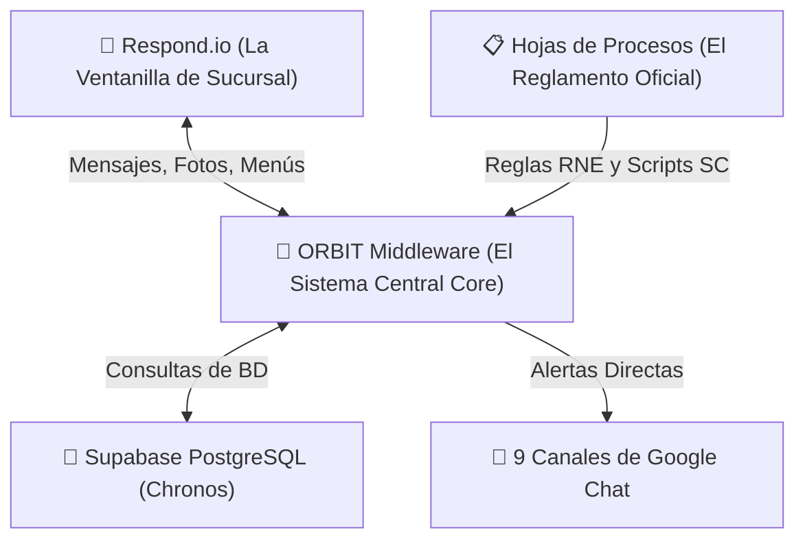

# 💼 DOSSIER ESTRATÉGICO DE DEFENSA DE PROYECTO
**Ecosistema de Inteligencia Conversacional Maxitransfers & ORBIT Middleware v4.7**  
**Documento Ejecutivo para Presentación ante el Comité de Proyectos | Agosto 2026**

---

## 📌 1. Resumen Ejecutivo y Pitch para el Comité

El proyecto **ORBIT Middleware** representa la evolución tecnológica de Maxitransfers para transformar el canal conversacional masivo de WhatsApp (operado en Respond.io) en una plataforma corporativa determinística, segura, auditable y conectada en tiempo real a los sistemas centrales de la empresa.

Actualmente, el ecosistema cuenta con un **nivel de estabilidad técnica global del 80-85% en su lógica central** y un **90-95% en los flujos principales de atención** (saludos, aviso de privacidad, rastreo de envíos y protección de datos). ORBIT no es simplemente un "bot de respuestas de IA", sino un motor inteligente de orquestación bancaria que aplica estrictamente las 59 Reglas de Negocio (RNE 01-59) y notifica automáticamente a los 9 departamentos corporativos de la empresa.

> 💡 **MENSAJE CLAVE DE DEFENSA PARA LA DIRECTORA:**  
> *"ORBIT elimina el riesgo de 'alucinaciones de IA' y garantiza que cada interacción con el cliente cumpla al 100% con los scripts oficiales de procesos, protegiendo los datos confidenciales de las remesas y alertando de inmediato a áreas críticas como Prevención de Fraudes, BSA y Soporte Técnico."*

---

## 🏛️ 2. La Analogía Operativa: ¿Cómo funciona el Ecosistema?

Para explicar de forma sencilla e irrefutable el valor del proyecto ante el Comité de Proyectos, el ecosistema se compone de tres elementos integrados que funcionan exactamente igual que una sucursal bancaria:

1. **Respond.io (La Ventanilla de Sucursal):**  
   Funciona como la ventanilla de recepción y atención al público. Es la interfaz visible en WhatsApp por donde el cliente envía mensajes, fotos de recibos, comprobantes o audios. Muestra los botones y el texto final al usuario, pero **NO toma decisiones de negocio por sí sola**.
2. **ORBIT Middleware (El Sistema Central Core):**  
   Es el cerebro informático y motor determinístico backend (desarrollado en FastAPI / Python). Recibe los datos de Respond.io, valida la identidad del usuario, consulta la base de datos de envíos (Chronos / Supabase), gestiona el estado en Redis, aplica las 59 Reglas de Negocio y selecciona el texto exacto oficial que debe responderse.
3. **Google Sheets / Matriz de Procesos (El Reglamento Corporativo):**  
   Constituyen el reglamento operativo oficial. Procesos administra las reglas y scripts `SC.001` al `SC.036` en hojas de cálculo en vivo que ORBIT lee automáticamente sin necesidad de reprogramación.

---

## ⚙️ 3. Integración Técnica y Arquitectura de Datos

La comunicación entre Respond.io y ORBIT se realiza mediante webhooks HTTP integrados en tiempo real con firma de seguridad cifrada (`X-Webhook-Secret`):

| Capa / Componente | Tecnología Utilizada | Función Operativa en el Ecosistema |
| :--- | :--- | :--- |
| **Interfaz Cliente** | Respond.io + WhatsApp Business API | Canal de entrada/salida conversacional, menú de opciones y envío de imágenes. |
| **Backend Core** | FastAPI (Python 3.13) en Render | Motor determinístico de orquestación, reglas RNE, FSM e integración de APIs. |
| **Memoria y Estado** | Redis Cache In-Memory | Administración de sesiones en vivo, persistencia de idioma (LNG.02) y contador de intentos. |
| **Base de Datos** | PostgreSQL (Supabase) | Consulta en tiempo real de transacciones de envíos, bill payments y recargas telefónicas. |

---

## 📢 4. Notificaciones en Tiempo Real a las 9 Áreas de Negocio

ORBIT no solo atiende al cliente en WhatsApp, sino que actúa como un sistema de alerta temprana notificando automáticamente a las 9 salas corporativas de Google Chat mediante tarjetas digitales inteligentes (Cards v2):

| Departamento / Área | Canal Dedicado en Google Chat | Beneficio Operativo para Maxitransfers |
| :--- | :--- | :--- |
| **Prevención de Fraudes** | `spaces/AAQAQM9pDpg` | Alerta roja inmediata en Turno 1 ante sospecha de estafa o phishing con datos del cliente. |
| **Monitoreo BSA / AML** | `spaces/AAQA3WL2JIk` | Detección de patrones de estructuración o fraccionamiento de envíos. |
| **Agent Oversight** | `spaces/AAQAJiVCDAU` | Canalización inmediata de notificaciones del IRS, cartas de auditoría o inspecciones. |
| **Soporte Técnico Agencias** | `spaces/AAQAQhx5RTM` | Atención prioritaria de fallas de hardware (escáner, impresoras, terminales POS en agencias). |
| **Cheques y Nómina** | `spaces/AAQAGZ_m434` | Reportes de verificación de depósitos y emisión de cheques. |
| **Cobranza y Comisiones** | `spaces/AAQAcEu8NTc` | Consultas sobre saldos pendientes y comisiones de agencias. |
| **Capacitación POS** | `spaces/AAQAMKgsazw` | Solicitudes de manuales de uso y entrenamiento técnico de terminales. |
| **Cumplimiento AML/KYC** | `spaces/AAQAbvCUAko` | Recepción de Formas P-4 y validaciones de documentos normativos. |
| **Ventas Internas** | `spaces/AAQAUghCztE` | Lead generation inmediato para registro y alta de nuevas agencias. |

---

## 📊 5. Nivel de Madurez Actual y Retorno de Inversión (ROI)

Los resultados recientes de las pruebas E2E (Evaluación al 14 de agosto de 2026) demuestran que el proyecto se encuentra en fase de estabilización avanzada:

* **Bienvenida y Aviso de Privacidad CU.A1 (90-95% Estabilidad):** Garantizado al 100% mediante el interceptor *Welcome Script Enforcer* en el Turno 1.
* **Consulta de Estatus de Envíos (85-90% Estabilidad):** Verificación precisa de claves CE..., estatus en BD Chronos y lectura OCR de tickets.
* **Privacidad de Datos de Beneficiarios (90% Estabilidad):** Protección estricta de la información confidencial del remitente ante terceros (`SC.019`).
* **Fallback y Transferencia a Asesor (85-90% Estabilidad):** Canalización efectiva a los ejecutivos de Servicio al Cliente ante consultas complejas.
* **Suite de Pruebas Unitarias Integradas:** 61 de 61 pruebas pasadas exitosamente en la suite automatizada del backend.

---

## 🛡️ 6. Matriz de Argumentos de Defensa ante el Comité

Respuestas preparadas ante las preguntas más probables del Comité de Proyectos:

* ❓ **¿Cómo aseguramos que la IA no cometa errores o alucine?**  
  * **Respuesta:** ORBIT opera bajo un modelo determinístico híbrido. Las reglas de negocio, scripts normativos y validaciones de base de datos se ejecutan mediante código estricto en ORBIT, impidiendo que la IA invente políticas o modifique montos.
* ❓ **¿El proyecto sustituye al personal de Servicio al Cliente?**  
  * **Respuesta:** ORBIT actúa como un filtro inteligente. Resuelve de forma automatizada hasta el 70% de las consultas repetitivas de estatus, liberando tiempo a los asesores para atender únicamente casos complejos.
* ❓ **¿Qué pasa si Respond.io cambia sus condiciones o precios?**  
  * **Respuesta:** ORBIT no es dependiente de un proveedor de chat. Toda la inteligencia, datos y reglas residen en la infraestructura propia de Maxitransfers (ORBIT), por lo que Respond.io o cualquier otra plataforma puede sustituirse si fuera necesario.
