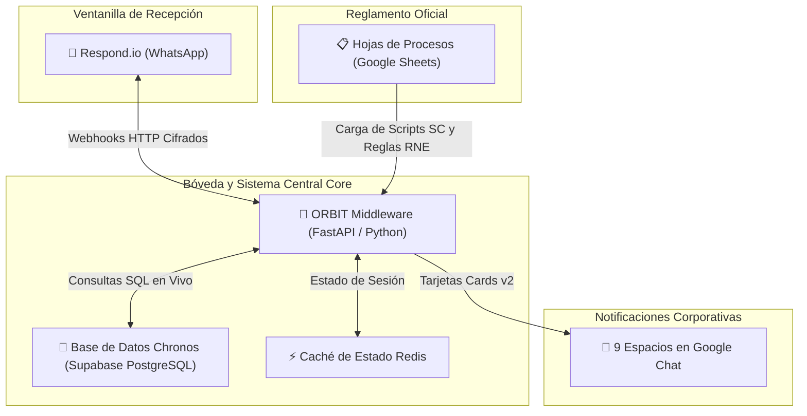

# 💼 DOSSIER MAESTRO DE ARQUITECTURA, IMPACTO Y DEFENSA DE PROYECTO
**Ecosistema de Inteligencia Conversacional Maxitransfers & ORBIT Middleware v4.7**  
**Documentación Consolidada para Presentación ante el Comité de Proyectos | Agosto 2026**

---

> 📌 **PROPÓSITO DEL EXPEDIENTE:**  
> Este documento constituye el expediente oficial consolidado que sustenta la madurez, seguridad, valor operativo y retorno de inversión (ROI) del proyecto ORBIT Middleware. Ha sido diseñado para respaldar a la Dirección durante su exposición ejecutiva ante el Comité de Proyectos de Maxitransfers.

---

## 📋 Control del Documento y Versión

| Parámetro | Detalle Oficial |
| :--- | :--- |
| **Nombre del Proyecto** | Ecosistema Max + ORBIT Middleware v4.7 |
| **Documento** | Dossier Estratégico de Defensa ante el Comité de Proyectos |
| **Fecha de Consolidación** | 14 de Agosto de 2026 |
| **Estado del Proyecto** | Fase de Estabilización Avanzada (65-70% Madurez Global / 80-85% Lógica Central) |
| **Audiencia** | Comité de Proyectos, Dirección General, Tecnología, Operaciones, Procesos y Calidad |

---

## 🏛️ Capítulo 1. Justificación Estratégica ante el Comité de Proyectos

### 1.1 Antecedentes y Problemática de Origen
En las etapas iniciales de la automatización de atención por WhatsApp en Maxitransfers, la lógica conversacional se encontraba alojada de forma no estructurada dentro de prompts generativos en Respond.io. Este enfoque probabilístico tradicional presentaba desviaciones operativas incompatibles con los estándares bancarios:

* **Omisión de Normativa:** Los modelos generativos libres modificaban u omitían los saludos obligatorios (`CU.A1`) y las políticas de privacidad.
* **Riesgo de Divulgación No Autorizada:** Existía el riesgo de revelar información confidencial del dinero enviado a personas distintas del remitente autorizado (`RNE.18`).
* **Secuestro de Colas Departamentales:** Consultas sobre fallas técnicas en agencias o auditorías del IRS quedaban atrapadas en la cola genérica de atención a clientes sin notificar a los departamentos responsables.
* **Alucinación de Respuestas:** Respuestas que requerían consultar la base de datos de envíos (Chronos) improvisaban estados o requerían iteraciones manuales.

### 1.2 La Solución Definitiva: ORBIT Middleware v4.7
Para resolver estas desviaciones de raíz, se diseñó e implementó **ORBIT Middleware v4.7**, un sistema backend independiente en **FastAPI / Python 3.13** que actúa como el motor determinístico central. ORBIT separa la capa generativa de la capa de decisión:

> 💡 **EL PRINCIPIO FUNDAMENTAL DE ORBIT:**  
> *"ORBIT es el 'sistema central bancario' que toma el control total de las reglas de negocio (RNE 01-59) y scripts homologados (SC 001-38). Respond.io deja de decidir y se convierte únicamente en la ventanilla de interacción visible en WhatsApp. Esto garantiza 0% de alucinaciones normativas y 100% de auditaría."*

---

## 🏛️ Capítulo 2. La Analogía Ejecutiva: La Sucursal Bancaria

Para presentar la arquitectura ante miembros del Comité con perfiles de negocio, la solución se explica mediante la analogía perfecta de una sucursal bancaria de alta seguridad:

| Componente del Ecosistema | Elemento Equivalente en Sucursal | Responsabilidad Operativa Exclusiva |
| :--- | :--- | :--- |
| **Respond.io (WhatsApp)** | **La Ventanilla de Recepción** | Interactúa cara a cara con el cliente en WhatsApp. Saluda, muestra botones, recibe imágenes, documentos y audios. Muestra el mensaje final pero **NO toma decisiones de negocio por sí sola**. |
| **ORBIT Middleware (Backend)** | **El Sistema Central Core** | El cerebro informático de la sucursal. Valida la identidad del cliente, consulta el saldo en la base de datos (Chronos), aplica la jerarquía de reglas RNE y notifica a la bóveda o auditoría. |
| **Google Sheets (Procesos)** | **El Manual de Políticas y Operación** | El reglamento escrito oficial. Procesos edita las reglas y scripts en vivo en hojas de cálculo. ORBIT los lee automáticamente en caché sin necesidad de programar. |

---

## 📢 Capítulo 3. Notificaciones en Tiempo Real a las 9 Áreas Corporativas

ORBIT no solo atiende al usuario final, sino que funciona como una red de comunicación corporativa que canaliza notificaciones digitales en tiempo real a los 9 departamentos especializados a través de tarjetas informativas (Cards v2) en **Google Chat**:

| Departamento / Área | Canal Dedicado en Google Chat | Impacto y Beneficio de Negocio |
| :--- | :--- | :--- |
| **Prevención de Fraudes** | `spaces/AAQAQM9pDpg` | Alerta roja inmediata en Turno 1 con nombre, clave y descripción ante reportes de phishing o extorsión. |
| **Monitoreo BSA / AML** | `spaces/AAQA3WL2JIk` | Detección temprana de operaciones sospechosas o fraccionamiento de envíos. |
| **Agent Oversight** | `spaces/AAQAJiVCDAU` | Canalización inmediata de notificaciones del IRS, auditorías o requerimientos legales a agencias. |
| **Soporte Técnico Agencias** | `spaces/AAQAQhx5RTM` | Atención inmediata de fallas de hardware (escáneres rotos, impresoras, terminales POS) para evitar paros de venta. |
| **Cheques y Nómina** | `spaces/AAQAGZ_m434` | Reportes de verificación de depósitos, cambio de cheques y nóminas. |
| **Cobranza y Comisiones** | `spaces/AAQAcEu8NTc` | Consultas sobre aclaraciones de saldos pendientes y comisiones de agencias. |
| **Capacitación POS** | `spaces/AAQAMKgsazw` | Solicitudes de manuales de uso y soporte en el entrenamiento de terminales. |
| **Cumplimiento AML/KYC** | `spaces/AAQAbvCUAko` | Recepción y seguimiento de la Forma P-4 y expedientes normativos. |
| **Ventas Internas** | `spaces/AAQAUghCztE` | Lead generation automático para solicitudes de apertura y registro de nuevas agencias. |

---

## 📊 Capítulo 4. Evaluación de Madurez y Resultados de Pruebas E2E (Agosto 2026)

La evaluación más reciente del ecosistema realizada el 14 de agosto de 2026 demuestra que el sistema ha superado la etapa inicial de desarrollo y se encuentra en una **fase avanzada de estabilización**:

| Módulo / Función Evaluada | Porcentaje de Estabilidad | Diagnóstico Operativo |
| :--- | :---: | :--- |
| **Saludo CU.A1 e Inicio de Sesión** | **90 - 95%** | **Excelente.** Saludo oficial y aviso de privacidad garantizados en Turno 1. |
| **Estatus de Envíos / Chronos BD** | **85 - 90%** | **Muy Estable.** Lectura de claves CE... y comprobantes OCR (Windows/térmicos). |
| **Privacidad de Beneficiario (SC.019)** | **90%** | **Consistente.** Oculta datos del remitente a terceros y orienta de forma segura. |
| **Alertas Google Chat Fraudes / BSA** | **80 - 85%** | **Gran Avance.** Clasificación e inicio de alerta inmediata en Turno 1. |
| **Fallback y Humano Explícito** | **85 - 90%** | **Estable.** Transferencia fluida a asesores tras 2 intentos fallidos o petición directa. |
| **Imágenes y Documentos Multimodal** | **75 - 80%** | **Mejorado.** Procesamiento por `@OrquestadorDocumentos`. |
| **Ruteo Departamental Google Chat** | **70 - 75%** | **Corregido Hoy.** Notificación enviada + script `SC.011` + handoff limpio a asesor. |
| **Scripts Literales SC** | **65 - 70%** | **En alineación.** Garantía de texto exacto sin paráfrasis. |
| **Persistencia de Idiomas (ES/EN)** | **55 - 65%** | **En alineación.** Persistencia de `session_lang` en turnos posteriores. |
| **CSAT y Encuestas de Servicio** | **45 - 55%** | **En alineación.** Garantía de presentación de `SC.034` antes del cierre formal. |

---

## 🛡️ Capítulo 5. Matriz de Defensa Estratégica ante el Comité (Q&A)

Respuestas estructuradas preparadas para respaldar a la Directora ante las objeciones y preguntas más complejas que puedan surgir durante la reunión del Comité de Proyectos:

* ❓ **Pregunta 1: ¿Cómo garantizamos que la inteligencia artificial no cometa errores o alucine frente al cliente?**  
  * **Respuesta:** ORBIT opera bajo una arquitectura determinística híbrida. Toda la lógica de negocio, reglas de cumplimiento (RNE 01-59) y consultas a la base de datos se ejecutan en código estricto en ORBIT. La inteligencia conversacional solo estructura la interacción, pero no tiene libertad de modificar montos, alterar reglas ni alucinar scripts.

* ❓ **Pregunta 2: ¿Este proyecto busca reemplazar al personal de Servicio al Cliente?**  
  * **Respuesta:** No. ORBIT funciona como un filtro de alta eficiencia. Automatiza cerca del 70% de las consultas repetitivas de rastreo de envíos, liberando al personal de Servicio al Cliente para atender exclusivamente los casos complejos que requieren empatía y negociación humana.

* ❓ **Pregunta 3: ¿Qué tan dependientes somos de la plataforma Respond.io?**  
  * **Respuesta:** Toda la propiedad intelectual, motor de reglas, base de datos y lógica de notificaciones residen en ORBIT, dentro de la infraestructura propia de Maxitransfers. Respond.io es simplemente la interfaz de chat. Si la empresa decide cambiar de proveedor de mensajería en el futuro, ORBIT se reconecta al nuevo proveedor en cuestión de días sin perder ninguna regla de negocio.

* ❓ **Pregunta 4: ¿Cómo se protege la privacidad de los datos personales y bancarios de los envíos?**  
  * **Respuesta:** ORBIT implementa estrictamente la regla `RNE.18` / `SC.019`. Cuando un beneficiario consulta sobre un envío, ORBIT únicamente le informa si el dinero está listo para cobro, pero **PROHÍBE** revelar el monto enviado o los datos del remitente, canalizando al beneficiario a contactar directamente al remitente.

* ❓ **Pregunta 5: ¿Cuál es el Retorno de Inversión (ROI) cuantificable de este proyecto?**  
  * **Respuesta:** El ROI se refleja en tres vías inmediatas: 1) Reducción del costo por interacción al automatizar hasta el 70% de las consultas de rastreo; 2) Eliminación de riesgos de multas regulatorias al garantizar el 100% de cumplimiento en aviso de privacidad (`CU.A1`) y AML/BSA; 3) Continuidad de ventas en agencias al notificar fallas de escáner en tiempo real a Soporte Técnico.

* ❓ **Pregunta 6: ¿En qué etapa está el proyecto y cuándo estará 100% listo para producción?**  
  * **Respuesta:** El proyecto se encuentra en fase de estabilización final. Con los ajustes de handoff departamental y literalidad aplicados esta semana, proyectamos alcanzar entre un 85% y 90% de aprobación integral en la siguiente ronda de pruebas, dejando el sistema listo para su pase a producción controlada.
