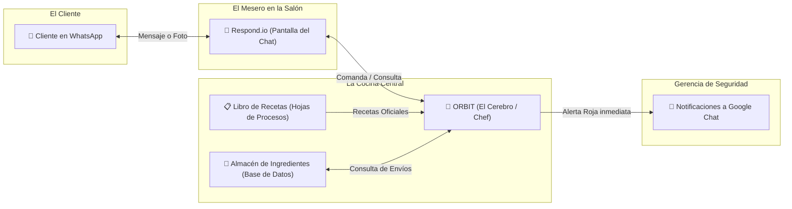

# 💡 GUÍA EJECUTIVA: CÓMO FUNCIONA EL ECOSISTEMA MAX + ORBIT EN LA VIDA REAL
**Explicación Sencilla en Palabras No Técnicas para la Presentación de la Directora ante el Comité de Proyectos**  
**Agosto 2026**

---

> 💡 **PROPÓSITO DEL DOCUMENTO PARA LA DIRECTORA:**  
> Este documento explica de forma 100% transparente, sencilla y conversacional cómo interactúan los clientes de Maxitransfers en WhatsApp, qué papel juega la plataforma Respond.io, cómo el sistema ORBIT toma las decisiones correctas sin inventar nada y cómo se defienden estas decisiones ante el Comité de Proyectos.

---

## 🍽️ 1. ¿Qué es ORBIT y qué es Respond.io en palabras sencillas?

Para entender el proyecto sin tecnicismos ni modismos informáticos, imagina la atención de un restaurante de alto prestigio:

* **Respond.io (La Pantalla de Chat y el Mesero):**  
  Respond.io es el **Mesero** que atiende la mesa del cliente en WhatsApp. Su trabajo es saludar de forma amable, entregar el menú, tomar la comanda (el mensaje, la duda o la foto que manda el cliente), llevarla a la cocina y traerle de regreso la respuesta final. El mesero es amable y visible, pero **el mesero NO cocina el platillo**.
* **ORBIT (El Cerebro y el Chef Ejecutivo):**  
  ORBIT es el **Chef Ejecutivo en la cocina central**. El Chef no sale a hablar con el cliente, pero es quien recibe la comanda, revisa la receta oficial de la empresa (las Reglas de Procesos), verifica si hay ingredientes en el almacén (la Base de Datos de envíos) y prepara la respuesta exactísima. Si el cliente pide algo delicado (como un reporte de fraude), el Chef avisa de inmediato a los gerentes de seguridad.
* **Las Hojas de Procesos (El Libro de Recetas Oficial):**  
  Es el Libro de Recetas Oficial de Maxitransfers. Es la lista de reglas escritas por el equipo de Procesos en hojas de cálculo. El Chef (ORBIT) sigue las recetas al pie de la letra sin cambiar ningún ingrediente.

---

## 🔄 2. Paso a Paso: ¿Cómo se conectan Respond.io y ORBIT en cada mensaje?

Cuando un cliente escribe un mensaje en el WhatsApp de Maxitransfers, sucede una cadena fluida de 4 pasos instantáneos que toman menos de 1 segundo:

| Paso | ¿Quién actúa? | ¿Qué sucede exactamente en palabras sencillas? |
| :--- | :--- | :--- |
| **Paso 1: Recepción** | **Respond.io (WhatsApp)** | El cliente envía un texto o foto (ej. *"¿Dónde está mi envío?"*). Respond.io recibe el mensaje en la pantalla del chat. |
| **Paso 2: La Consulta** | **Respond.io a ORBIT** | Respond.io le dice a ORBIT: *"Me llegó este mensaje de este cliente. Tú eres el cerebro, dime exactamente qué debo responderle"*. |
| **Paso 3: La Decisión** | **ORBIT (El Cerebro)** | ORBIT revisa el manual de reglas de Procesos, consulta la base de datos para ver el estatus real del envío y genera la frase oficial exacta. |
| **Paso 4: La Entrega** | **ORBIT a Respond.io** | ORBIT le entrega el texto oficial a Respond.io. Respond.io lo publica en la pantalla de WhatsApp del cliente y, si aplica, transfiere al cliente con un asesor humano. |

---

## 📱 3. Tres Ejemplos de Interacciones Reales en la Vida Real

### Ejemplo 1: Un cliente pregunta por el estatus de su dinero enviado
1. **Mensaje del Cliente:** Un cliente envía por WhatsApp: *"Hola buenos días, quiero saber si mi hermana ya cobró el envío 40001 en Honduras"*.
2. **Acción de Respond.io:** Respond.io recibe el mensaje y se lo pasa de inmediato a ORBIT.
3. **Evaluación de ORBIT:** ORBIT saluda amablemente con el script oficial (`CU.A1`), incluye el aviso de privacidad, busca la transacción 40001 en la base de datos de envíos (Chronos) y confirma que el estado es *"DISPONIBLE PARA COBRO"*.
4. **Respuesta Final:** Respond.io muestra el mensaje oficial en la pantalla del cliente: *"Gracias por comunicarse a Maxitransfers. Le informamos que su envío 40001 se encuentra listo para ser cobrado por el beneficiario"*.

---

### Ejemplo 2: Una sospecha de Fraude o Extorsión (Alerta Inmediata)
1. **Mensaje del Cliente:** Un usuario escribe: *"Recibí una llamada de alguien diciendo que es de Maxitransfers pidiéndome el código PIN de mi transacción"*.
2. **Acción de Respond.io:** Respond.io recibe el texto y se lo envía a ORBIT.
3. **Evaluación de ORBIT:** ORBIT detecta que se trata de un intento de fraude. Activa de inmediato una **Alerta Roja** y manda una notificación directa al grupo corporativo de Prevención de Fraudes en Google Chat con los datos del cliente.
4. **Respuesta y Transferencia:** ORBIT le da a Respond.io el script de seguridad oficial e instruye a Respond.io a transferir la conversación inmediatamente a un asesor especializado de Fraudes.

---

### Ejemplo 3: Una Agencia reporta una falla técnica en su escáner
1. **Mensaje de la Agencia:** Una agencia en Chicago envía una foto de un comprobante atascado y escribe: *"Se descalibró el escáner de la agencia y no procesa los cheques"*.
2. **Acción de Respond.io:** Respond.io recibe la imagen y el texto, enviándolo a ORBIT.
3. **Evaluación de ORBIT:** ORBIT analiza la imagen del escáner, clasifica la falla como soporte de hardware y manda una alerta prioritaria al grupo de Soporte Técnico en Google Chat.
4. **Respuesta Final:** Respond.io le responde a la agencia con el script oficial (`SC.011`) de canalización y asigna el caso a Soporte Técnico para resolución en tiempo real.

---

## 🛡️ 4. Matriz de Defensa Estratégica para la Directora (Respuestas para el Comité)

Respuestas preparadas en lenguaje 100% claro y convincente para defender el proyecto ante el Comité:

* ❓ **¿Por qué no usamos solo Respond.io y tuvimos que crear ORBIT?**  
  * **Respuesta:** Respond.io es una excelente plataforma para mostrar mensajes en WhatsApp y gestionar chats, pero no fue diseñada para consultar bases de datos bancarias ni memorizar reglas complejas. Si dejáramos que Respond.io decidiera solo, el bot inventaría respuestas. ORBIT es el cerebro corporativo que garantiza que cada palabra cumpla con las políticas de Maxitransfers.

* ❓ **¿Cómo garantizamos que el sistema no invente cosas o engañe a un cliente?**  
  * **Respuesta:** Porque la inteligencia artificial no tiene libertad para inventar políticas ni montos. ORBIT obliga a la IA a consultar el manual de reglas oficial aprobado por Procesos. Si el cliente pregunta algo fuera del manual, ORBIT no inventa nada; simplemente entrega el script oficial de transferencia y pasa el chat a un asesor humano.

* ❓ **¿Este sistema busca reemplazar a nuestros asesores humanos?**  
  * **Respuesta:** No. El sistema es un filtro inteligente que resuelve hasta el 70% de las preguntas repetitivas (como *"¿ya llegó mi dinero?"*). Esto libera a nuestros asesores de responder lo mismo todo el día y les permite enfocarse en casos complejos que requieren atención humana.

* ❓ **¿Cómo protegemos la privacidad de las remesas para que no le den datos a desconocidos?**  
  * **Respuesta:** Aplicamos una regla estricta de protección de datos (`RNE.18`). Si la persona que pregunta es el beneficiario (quien recibe), el sistema NUNCA le revela cuánto dinero se envió ni los datos privados del remitente. Únicamente le confirma si el giro está listo para cobro.
