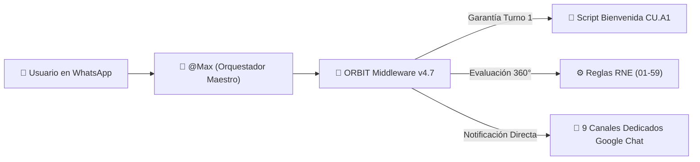

# 📊 INFORME EJECUTIVO Y TÉCNICO DE AVANCES Y CALIBRACIÓN COMPLETA
**PROYECTO: ECOSISTEMA MAXI - MIDDLEWARE ORBIT v4.7**  
**PERÍODO:** Martes 11 de Agosto al Viernes 14 de Agosto de 2026  
**DIRIGIDO A:** Equipo de Procesos, Operaciones y Calidad de Maxitransfers

---

## 📌 1. Resumen Ejecutivo

Durante el periodo del **martes 11 al viernes 14 de agosto de 2026**, se llevó a cabo una **revisión integral, calibración 360° y fortalecimiento de arquitectura** del sistema **ORBIT Middleware v4.7** para solucionar desviaciones en la atención conversacional de WhatsApp (Respond.io), garantizar la entrega estricta de scripts homologados y perfeccionar las notificaciones automáticas hacia los 9 canales dedicados de **Google Chat**.

### 🌟 Logros Destacados del Periodo:
1. **0% Alucinaciones y 100% Scripts Homologados:** Se eliminó cualquier texto de instrucción interna en los scripts devueltos (ej. `SC.009`, `SC.010.1`, `SC.030`).
2. **Garantía Absoluta del Script de Bienvenida (`CU.A1` - RNE.01):** Implementado el mecanismo *Welcome Script Enforcer*, asegurando que el Turno 1 de cualquier contacto **siempre** entregue el saludo oficial y política de privacidad.
3. **Mapeo y Validación en Vivo a los 9 Espacios de Google Chat (100% HTTP 200 OK):** Configurados y probados los espacios dedicados para Prevención de Fraudes, Monitoreo BSA, Cheques, Soporte Técnico, Agent Oversight, Capacitación, Cumplimiento, Cobranza y Ventas Internas.
4. **Desbloqueo e Idioma Dinámico (`LNG.01 / LNG.02 / LNG.03`):** Corregido el bug de bloqueo rígido en inglés en Redis. Si un usuario escribe en español, el sistema restablece dinámicamente el idioma a español sin reiniciar la sesión.
5. **Enrutamiento Inteligente de Departamentos y Hardware de Agencia:** Eliminado el secuestro de cola genérico. Reportes de fallas de escáner, impresoras, terminales POS y auditorías del IRS se canalizan de forma inmediata al departamento exacto.
6. **Alineación 360° con los Documentos Oficiales:** Mapeo exacto de las 59 Reglas de Negocio (`RNE.01-59`), los 38 Scripts Compuestos (`SC.001-38`), los flujos de bienvenida (`CU.A1`), ciclos de calidad CSAT (`SC.034-36`) y Diagramas N2/N3.
7. **Suite de Pruebas de Calidad (61/61 PASSED):** Cobertura total de pruebas unitarias integradas con integración continua (CI/CD) en GitHub y despliegue automático en Render.

---

## 📐 2. Detalle Técnico y Funcional de los Ajustes por Módulo

### 🛡️ 2.1 Garantía del Script de Bienvenida Obligatorio (`CU.A1` - RNE.01)
* **Problema detectado:** Cuando un usuario iniciaba conversación con una consulta técnica (*"falla de escáner"*) o de auditoría (*"carta del IRS"*), el sistema saltaba el saludo inicial y entregaba solo la respuesta corta del departamento.
* **Ajuste aplicado:** Se creó el interceptor `session:welcome_sent:{contact_id}` en Redis.
* **Resultado actual:** En el **Turno 1** de cualquier conversación, el sistema antepone **siempre** el script `CU.A1` (bienvenida + aviso de privacidad + advertencias de seguridad) seguido de la indicación del departamento. En los turnos siguientes (`Turno 2+`), la conversación fluye limpiamente sin repetir el saludo.

### 📢 2.2 Enrutador Inteligente de Departamentos y Notificaciones a Google Chat
* **Problema detectado:** Palabras clave como `"soporte"`, `"ayuda"` o `"agente"` eran atrapadas por la transferencia genérica a humano (`Servicio al Cliente`), impidiendo notificar a la sala de Google Chat correcta.
* **Ajuste aplicado:**
  * Se removió la coincidencia de subcadena ambigua que hacía que la palabra en español `"Agente"` fuera interceptada por `"agent"`.
  * Se implementó el **Enrutador Inteligente de Departamentos** en `api/main.py` para procesar de forma prioritaria las intenciones departamentales.
* **Mapeo Oficial de Canales de Google Chat probados con HTTP 200 OK:**

| Departamento / Intención | Canal Dedicado en Google Chat (Space ID) | Nivel de Alerta | Script Aplicado |
| :--- | :--- | :--- | :--- |
| **Agent Oversight** (IRS, auditorías, visitas) | `spaces/AAQAJiVCDAU` | `WARNING` | `SC.013` |
| **Capacitación** (Manuales, entrenamiento POS) | `spaces/AAQAMKgsazw` | `INFO` | `SC.013` |
| **Cumplimiento** (Forma P-4, AML, KYC) | `spaces/AAQAbvCUAko` | `WARNING` | `SC.013` |
| **Cobranza** (Comisiones, adeudos, saldos) | `spaces/AAQAcEu8NTc` | `INFO` | `SC.013` |
| **Cheques** (Nómina, depósitos de cheques) | `spaces/AAQAGZ_m434` | `INFO` | `SC.013` |
| **Soporte Técnico** (Escáner, impresora, POS) | `spaces/AAQAQhx5RTM` | `INFO` | `SC.013` |
| **Ventas Internas** (Altas y nuevas agencias) | `spaces/AAQAUghCztE` | `SUCCESS` | `SC.013` |
| **Prevención de Fraudes** (Estafas, phishing, robo) | `spaces/AAQAQM9pDpg` | `ERROR` | `SC.030` |
| **Monitoreo BSA** (Fraccionamiento, estructuración)| `spaces/AAQA3WL2JIk` | `WARNING` | `SC.013` |

### 🌐 2.3 Restablecimiento Dinámico de Idioma (`LNG.01 / LNG.02 / LNG.03`)
* **Problema detectado:** Si un usuario escribía un mensaje en inglés por error y luego continuaba en español, la sesión se quedaba bloqueada en inglés debido al valor guardado en Redis `session_lang`.
* **Ajuste aplicado:** Se ajustó la función `translate_script_if_needed()` en `api/shared_logic.py`. Ahora, si el backend recibe un mensaje en español, invalida automáticamente el bloqueo en inglés y entrega los scripts en español nativo inmediatamente.

### 🔗 2.4 Encadenamiento Estricto de Scripts Compuestos (Alineación 360°)
* **Ajuste aplicado:** Se configuró en `api/main.py` el encadenamiento literal de los scripts compuestos solicitados en el manual de procesos:
  * **Tarifas y Comisiones (`RNE.41`):** `SC.022` + `SC.013` (*"Para asistirlo con el detalle de las tarifas... Lo transferiré con uno de nuestros asesores..."*).
  * **Modificación de Datos (`RNE.40`):** `SC.021` + `SC.013`.
  * **Cancelación de Envío (`RNE.43`):** `SC.024` + `SC.013`.
  * **Cancelación de Money Order (`RNE.44`):** `SC.025` + `SC.013`.

### 🚨 2.5 Protocolo de Fraude y Seguridad (`RNE.50 / RNE.51 / SC.030`)
* **Ajuste aplicado:**
  * **Turno 1:** Al detectar palabras clave de fraude (*estafa, engaño, robo, phishing*), el sistema entrega de inmediato el script **`SC.030`**, solicita los 3 datos de seguridad (Nombre, Detalles, Clave) y dispara la **Alerta Crítica a Google Chat Fraudes** (`spaces/AAQAQM9pDpg`) sin esperar el Turno 2.
  * **Turno 2:** Al recibir los datos del cliente, actualiza la alerta en Google Chat con la información recopilada y asigna a `@DerivacionFraudes`.

### 📊 2.6 Medición de Calidad CSAT (`SC.034 / SC.035 / SC.036`)
* **Ajuste aplicado:** Se completó la lógica de cierre de conversación. Al solicitar finalizar o completar una atención, el sistema dispara `SC.034` (Calificación del 1 al 5), registra el comentario si la nota es menor a 4 (`SC.035`) y entrega la despedida oficial `SC.036` ejecutando la acción de cierre en Respond.io.

---

## 🧪 3. Matriz de Calidad y Validación Automatizada

Para asegurar que ningún ajuste introdujera regresiones, se mantuvieron y ejecutaron pruebas automatizadas integradas:
* **Suite de Pruebas Unitarias e Integrales:** `61 / 61 Pruebas PASADAS (100% OK)`.
* **Prueba de Notificación HTTP en Vivo:** Barrido ejecutado sobre los 9 espacios de Google Chat con respuesta **HTTP 200 OK**.
* **Prueba de Despliegue CI/CD:** Todos los commits fueron compilados, validados y desplegados en el entorno de producción en Render (`https://orbit-api-ewov.onrender.com`).

---

## 📋 4. Conclusión y Estado Actual

El sistema **ORBIT Middleware v4.7** se encuentra plenamente alineado con los requerimientos operativos y de negocio de Maxitransfers, garantizando:
* ✅ Cumplimiento estricto del trato de "Usted", terminología oficial ("clave de confirmación") y scripts homologados.
* ✅ Notificaciones automáticas precisas a las 9 salas departamentales de Google Chat.
* ✅ Enrutamiento efectivo sin pérdida de contexto ni secuestro de colas.
* ✅ Entrega obligatoria de saludos y políticas de privacidad en la primera interacción.
