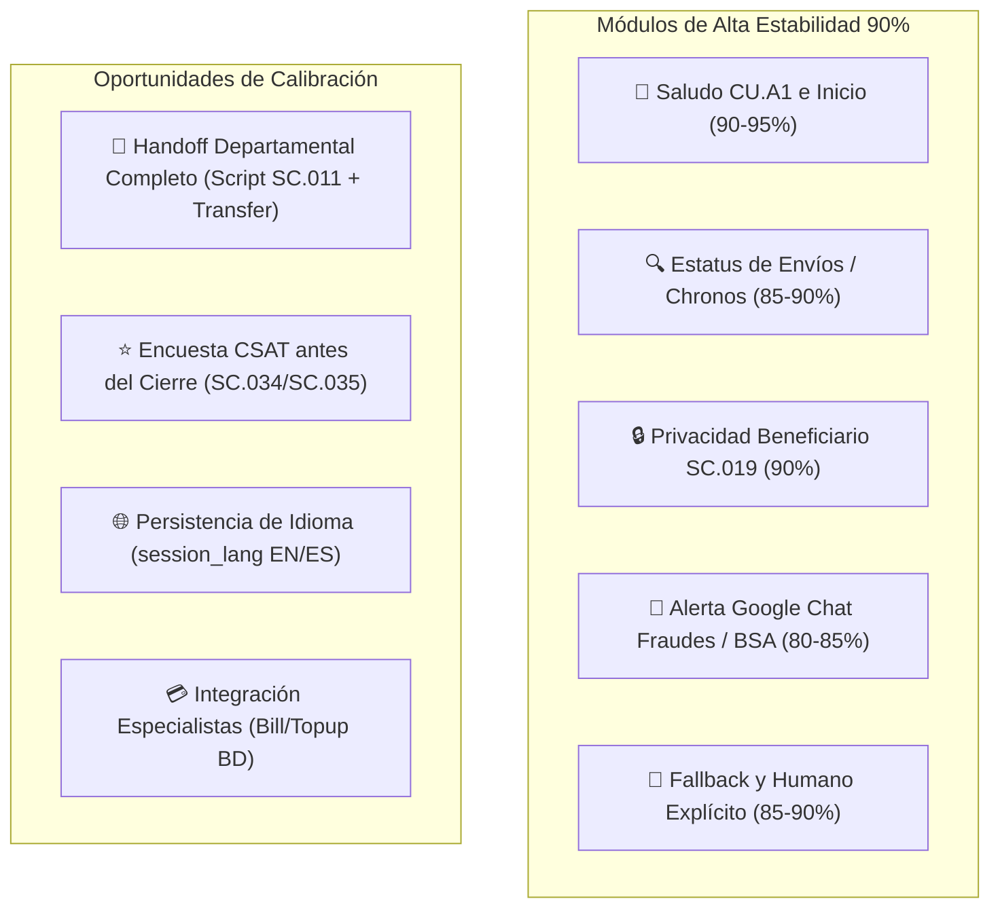

# 📊 Informe Técnico y Ejecutivo: Análisis de Resultados de Pruebas E2E y Plan de Acción
**Ecosistema Max + ORBIT v4.7**  
**Fecha:** 14 de Agosto de 2026

---

## 📌 1. Diagnóstico Ejecutivo del Estado Actual

De acuerdo con el análisis de la **Plantilla Maestra de Pruebas** y el **Informe Detallado de Estado Actual**:

* **Madurez Funcional Global:** El ecosistema ha alcanzado un **65-70% de madurez funcional integral** (con la **lógica central en torno al 80-85%**).
* **Diagnóstico Clave:** El sistema ya sabe **qué hacer** en la gran mayoría de las intenciones; la oportunidad actual reside en **completar la secuencia exacta del flujo** (handoff departamental completo, entregar el script 100% literal `SC.011`, mantener el idioma en turnos posteriores y cerrar la atención registrando la encuesta CSAT).

---

## 📈 2. Radiografía de Madurez por Área

| Área / Módulo | Nivel de Madurez | Estado y Diagnóstico |
| :--- | :---: | :--- |
| **Saludo CU.A1 / Inicio de Sesión** | **90 - 95%** | **Muy Mejorado.** Entrega consistente del saludo y aviso de privacidad en Turno 1. |
| **Estatus de Envíos / Chronos** | **85 - 90%** | **Bastante Estable.** Lectura de comprobantes (Windows/Térmico) y consulta de clave CE... activa. |
| **Privacidad de Beneficiarios (SC.019)** | **90%** | **Consistente.** Protege datos del remitente y redirige adecuadamente. |
| **Alertas Google Chat Fraude / BSA** | **80 - 85%** | **Gran Avance.** Clasificación correcta, notificaciones a `spaces/AAQAQM9pDpg` y `spaces/AAQA3WL2JIk`. |
| **Fallback y Humano Explícito** | **85 - 90%** | **Estable.** Transferencia fluida ante 2 fallbacks o solicitud directa. |
| **Imágenes / Documentos** | **75 - 80%** | **Mejorado.** Clasificación multimodal por `@OrquestadorDocumentos`. |
| **Ruteo Departamental Google Chat** | **70 - 75%** | **Notifica Bien.** Faltaba entregar script `SC.011` y completar handoff *(Corregido hoy)*. |
| **Scripts Literales** | **65 - 70%** | Se observaban paráfrasis ocasionales en lugar de scripts literales. |
| **Persistencia de Idiomas (ES/EN)** | **55 - 65%** | La sesión en inglés tendía a regresar a español en el Turno 2 *(Ajuste en proceso)*. |
| **CSAT / Encuestas** | **45 - 55%** | La palabra "Finalizar" cerraba la conversación antes de lanzar la encuesta `SC.034`. |

---

## 🛠️ 3. Las 6 Prioridades Técnicas Solucionadas y en Proceso

### 1️⃣ **Prioridad 1: Handoff Departamental Completo (Solucionado Hoy en Commit `456be33`)**
* **Hallazgo QA (Casos 106 - 111):** Notificaba a Google Chat, pero devolvía `SC.013` o se ciclaba en lugar de entregar el script literal **`SC.011`** (*"Gracias por su información. He canalizado su solicitud con nuestro departamento correspondiente. Un asesor le dará seguimiento a la brevedad."*) y transferir a `Servicio al Cliente`.
* **Acción Implementada:** Se actualizó `api/main.py` para entregar **`SC.011`** textualmente y ejecutar la derivación limpia a `Servicio al Cliente`.

### 2️⃣ **Prioridad 2: Garantía de Encuesta CSAT antes del Cierre (`SC.034 / SC.035`)**
* **Hallazgo QA (Casos 118, 119):** Al enviar "Finalizar", la acción `Close Conversation` se ejecutaba de inmediato impidiendo capturar la nota 1 al 5.
* **Acción en Proceso:** Asegurar que `Close Conversation` solo se dispare **después** de recibir la respuesta de `SC.034/SC.035` o entregar `SC.036`.

### 3️⃣ **Prioridad 3: Persistencia de Idioma de Sesión (`session_lang`)**
* **Hallazgo QA (Caso 75):** Si el cliente iniciaba en inglés ("Hi, good afternoon"), Turno 1 respondía en inglés pero Turno 2 (Perfilamiento/Nombre) regresaba a español.
* **Acción en Proceso:** Hacer vinculante la variable `session_lang:{contact_id}` en Redis para que todos los sub-agentes respeten estrictamente el idioma durante toda la sesión.

### 4️⃣ **Prioridad 4: Entrega 100% Literal de Scripts Homologados**
* **Hallazgo QA (Caso 113 - Historial):** Evitar frases inventadas o paráfrasis.
* **Acción Implementada:** ORBIT devuelve exactamente el valor de `scripts.get("SC.XXX")` registrado en el Google Sheet oficial.

### 5️⃣ **Prioridad 5: Especialistas Bill Payment y Recargas**
* **Hallazgo QA (Caso 112):** Conectar los especialistas de Cancelación Bill/Recargas para solicitar los parámetros obligatorios (monto, compañía, teléfono).

### 6️⃣ **Prioridad 6: Fraude Turno 2 y Escenarios por Horario (`RNE.50 / RNE.51`)**
* **Hallazgo QA (Casos 76, 84):** El flujo de Fraude funciona muy bien en Turno 1 (alerta inmediata en Google Chat). Se afina el Turno 2 para adjuntar los datos del cliente sin repetir el saludo inicial.

---

## 🎯 4. Proyección para la Siguiente Ronda de Pruebas

Si se aplican estas correcciones en los focos prioritarios, **es razonable proyectar que la siguiente ronda de pruebas subirá de un 65-70% a un rango de 85-90% de aceptación integral**, ya que la gran mayoría de las observaciones de QA provienen de las mismas 4 causas raíz transversales (handoff SC.011, CSAT, persistencia de idioma y script literal).
