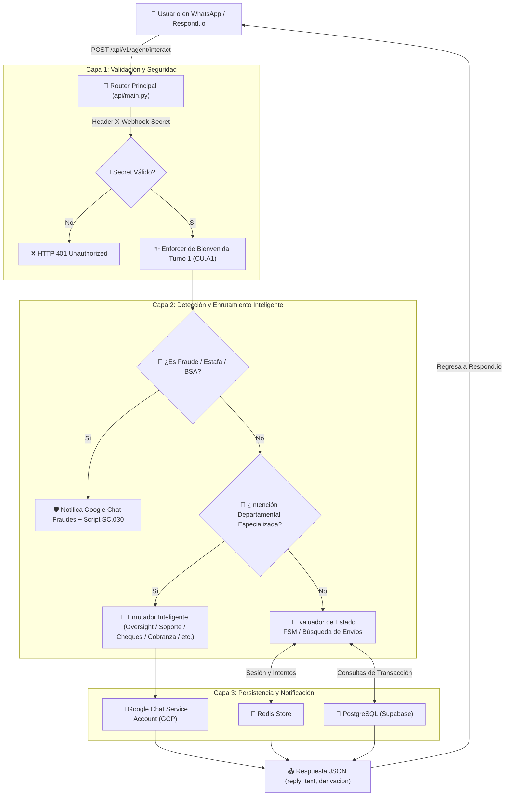

# 📘 Manual Canónico de Arquitectura y Guía de Desarrollo Backend: Middleware ORBIT v4.7
**Ecosistema Maxitransfers | ORBIT Middleware API**

---

## 📌 1. Propósito y Visión General del Sistema

El **Middleware ORBIT** es una API backend desarrollada en **Python 3.13 / FastAPI** que sirve como el cerebro operativo y motor de reglas para el canal conversacional de WhatsApp (vía **Respond.io**).

### 🔄 Flujo de Vida de una Petición HTTP (`/api/v1/agent/interact`)



---

## 📁 2. Arquitectura de Módulos y Mapa de Responsabilidades

El código del proyecto está estrictamente modularizado en la carpeta `respondio-middleware/api/`:

```
respondio-middleware/
├── api/
│   ├── main.py                   # 🧠 NÚCLEO PRINCIPAL (FastAPI, Routers, Enrutador Inteligente, FSM y Reglas)
│   ├── config.py                 # ⚙️ CONFIGURACIÓN Y ENTORNO (Pydantic Settings, IDs, Constantes y Secrets)
│   ├── google_chat_service.py    # 💬 INTEGRACIÓN GOOGLE CHAT (Autenticación SA JWT, Formateo de Card Alerts)
│   ├── shared_logic.py           # 🛠️ SERVICIOS COMPARTIDOS (Supabase DB, Redis Client, Idioma Dinámico LNG.02)
│   ├── admin_api.py              # 🔧 ENDPOINTS DE ADMINISTRACIÓN (Alertas HTTP directas, CSAT, Telemetría)
│   └── telemetry.py              # 📈 TELEMETRÍA Y EVENTOS (Log de eventos a Google Sheets)
├── tests/
│   ├── test_api.py               # 🧪 SUITE DE PRUEBAS UNITARIAS (61 Casos de Prueba con Pytest)
│   └── test_scripts_rules.py     # 🧪 PRUEBAS DE CONFIGURACIÓN Y HOJAS DE CÁLCULO
├── requirements.txt              # 📦 Dependencias Python requeridas
└── MAPA_ARQUITECTURA_ORBIT.md    # 📘 Este documento de referencia
```

---

## 🔍 3. Descripción Detallada Módulo por Módulo

### 🧠 3.1 `api/main.py` — El Núcleo de la Aplicación
* **`agent_interact()` (Línea ~3475):** Endpoint decorado POST `/api/v1/agent/interact`. Recibe el payload JSON de Respond.io. Ejecuta la verificación en Redis de `session:welcome_sent:{contact_id}` para asegurar que el script de bienvenida (`CU.A1`) se entregue siempre en el **Turno 1** de la conversación.
* **`agent_interact_inner()` (Línea ~3493):** Ejecuta la lógica central:
  1. **Autenticación:** Compara `X-Webhook-Secret` con `WEBHOOK_SECRET` (`maxi-secret-2025`).
  2. **Detección Prioritaria de Fraudes:** Bloque `# Detección de Fraude y Riesgo / BSA`.
  3. **Enrutador Inteligente de Departamentos:** Bloque `# ENRUTADOR INTELIGENTE DE DEPARTAMENTOS`. Evalúa intenciones departamentales (IRS, Escáner/Hardware, Cheques, Cobranza, Cumplimiento, Capacitación, Ventas) y dispara las notificaciones a Google Chat.
  4. **FSM (Máquina de Estados de Transacciones):** Maneja los estados `NEW`, `WAITING_FOR_NAME`, `WAITING_FOR_CODE`, `COMPLETED`.
* **Consultas de Transacción:**
  * `check_transaction_status_inner()`: Consulta de remesas en Supabase.
  * `check_bill_status_inner()`: Consulta de pagos de servicios (Bill Payments).
  * `check_topup_status_inner()`: Consulta de recargas telefónicas.

### ⚙️ 3.2 `api/config.py` — Configuración y Parámetros de Entorno
Define la clase `Settings` (Pydantic BaseSettings) que carga variables desde `.env` o valores por defecto:
* **`WEBHOOK_SECRET`:** Secreto oficial de autenticación (`maxi-secret-2025`).
* **`GOOGLE_SHEET_ID_REGLAS`:** ID de la hoja de Google Sheets para Reglas de Negocio (`1eFm3L_ALVr78wTDBB2bsg7Wq6DT9ZoGzIX9tKLN9nGw`).
* **`GOOGLE_SHEET_ID_SCRIPTS`:** ID de la hoja de Google Sheets para Scripts Oficiales (`18VE3tdVt4E-eNrf0dD4zlk1aLV2nfv9_ncdUvLPaNic`).
* **IDs de Canales de Google Chat:** `GOOGLE_CHATS_FRAUDES_SPACE`, `GOOGLE_CHATS_BSA_SPACE`, `GOOGLE_CHATS_CHEQUES_SPACE`, `GOOGLE_CHATS_SOPORTE_SPACE`, etc.

### 🛠️ 3.3 `api/shared_logic.py` — Conexiones e Idioma
* **`get_db_connection()`:** Crea pool de conexión PostgreSQL hacia la base de datos Supabase usando `psycopg2`.
* **`get_redis_client()`:** Instancia asíncrona de cliente Redis (`redis.asyncio`).
* **`translate_script_if_needed()`:** Implementa la regla **LNG.02 (Restablecimiento Dinámico de Idioma)**. Si el mensaje del usuario contiene texto en español, desactiva la traducción automática y devuelve el script en español original.

### 💬 3.4 `api/google_chat_service.py` — Notificaciones a Google Chat
* Maneja la autenticación OAuth2 JWT mediante la Service Account (`maxibot-sa@maxibot-472423.iam.gserviceaccount.com`) decodificando la variable de entorno `GOOGLE_CHATS_SA_BASE64`.
* Método `send_alert_detailed()`: Formatea y envía tarjetas de notificación (Cards v2) a los espacios especificados por `space_id`.

---

## 🛠️ 4. Recetario de Desarrollo: ¿Cómo y dónde hacer cambios?

### 📖 **Receta A: Agregar o modificar un Departamento o Canal de Google Chat**
1. **Paso 1 (Configuración):** En `api/config.py`, agrega o verifica la constante de `space_id` del canal.
2. **Paso 2 (Enrutador):** En `api/main.py`, busca el bloque `# ENRUTADOR INTELIGENTE DE DEPARTAMENTOS`.
3. **Paso 3 (Añadir Regla):** Agrega las palabras clave de detección y el envío de la notificación:
```python
# Ejemplo: Nuevo Departamento
nuevo_dept_keywords = ["palabra1", "palabra2", "frase clave"]
if any(k in user_text_lower for k in nuevo_dept_keywords):
    msg = f"🏛️ *REPORTE DE NUEVO DEPARTAMENTO*\n\n👤 *Contacto:* {contact_id}\n📝 *Detalle:* {user_text}"
    await google_chat_service.send_alert_detailed(title="Alerta de Orbit", message=msg, level="INFO", space_id="spaces/SU_SPACE_ID")
    sc13_text = scripts.get("SC.013", "Lo transferiré con un asesor.")
    translated = await translate_script_if_needed(sc13_text, user_text, contact_id=contact_id)
    return AgentInteractResponse(status="success", reply_text=translated, derivacion="NombreDelEquipo")
```

### 📖 **Receta B: Modificar un Script de Respuesta Oficial**
* **Fuentes de Verdad:** Los scripts oficiales (`SC.001` al `SC.036` y `CU.A1`) residen en Google Sheets ID `18VE3tdVt4E-eNrf0dD4zlk1aLV2nfv9_ncdUvLPaNic`.
* **Comportamiento en Código:** El backend lee la hoja y la almacena en caché de Redis (`scripts_cache`). Si actualizas el Sheet, puedes limpiar la caché enviando el comando `reset` en el chat o reiniciando el servicio.

### 📖 **Receta C: Modificar las Palabras Clave de Transferencia a Humano Genérico**
* **Ubicación:** `api/main.py`, en el bloque `# Asesor humano explícito`.
* **Regla importante:** Mantener coincidencia exacta de palabras completas (`\b` o iteración de palabras) para evitar que subcadenas como `"agente"` coincidan accidentalmente con `"agent"`.

### 📖 **Receta D: Modificar la Base de Datos o Consultas SQL**
* **Ubicación:** `api/main.py`, dentro de las funciones `check_transaction_status_inner()` o `HistorialEnvios`.
* **Tabla afectada:** `"Base_completa"`.
* **Columnas principales:** `"Clave_Envio"`, `"Telefono_Remitente"`, `"Telefono_Beneficiario"`, `"Nombre_Remitente"`, `"Nombre_Beneficiario"`, `"status"`, `"Fecha"`.

---

## 🗄️ 5. Esquema de Llaves de Sesión en Redis (`Redis Keys`)

| Patrón de Llave Redis | Expiración | Propósito / Uso |
| :--- | :--- | :--- |
| `session:welcome_sent:{contact_id}` | 3600s (1 hr) | Marca si ya se entregó el script inicial `CU.A1` en la sesión activa. |
| `session:state:{contact_id}` | 3600s (1 hr) | Estado actual FSM (`NEW`, `WAITING_FOR_NAME`, `WAITING_FOR_CODE`, `COMPLETED`). |
| `session:codigo_envio:{contact_id}` | 3600s (1 hr) | Clave de transacción (CE...) capturada en la sesión. |
| `session:fraud_collecting:{contact_id}` | 3600s (1 hr) | Bandera activa cuando el usuario está en flujo de recolección de reporte de fraude. |
| `contact:last_image:{contact_id}` | 3600s (1 hr) | Caché de la última URL de imagen recibida vía webhook. |
| `contact:session_text:{contact_id}` | 3600s (1 hr) | Último texto enviado por el contacto. |

---

## 📊 6. Tabla Canónica de Espacios de Google Chat

| Departamento / Destino | Identificador de Espacio (Space ID) | Nivel de Alerta |
| :--- | :--- | :--- |
| **Agent Oversight** | `spaces/AAQAJiVCDAU` | `WARNING` |
| **Capacitación** | `spaces/AAQAMKgsazw` | `INFO` |
| **Cumplimiento (AML/KYC)** | `spaces/AAQAbvCUAko` | `WARNING` |
| **Cobranza** | `spaces/AAQAcEu8NTc` | `INFO` |
| **Cheques** | `spaces/AAQAGZ_m434` | `INFO` |
| **Soporte Técnico** | `spaces/AAQAQhx5RTM` | `INFO` |
| **Ventas Internas** | `spaces/AAQAUghCztE` | `SUCCESS` |
| **Prevención de Fraudes** | `spaces/AAQAQM9pDpg` | `ERROR` |
| **Monitoreo BSA** | `spaces/AAQA3WL2JIk` | `WARNING` |

---

## ⚙️ 7. Entorno de Desarrollo, Pruebas y Despliegue

### 🚀 **Ejecución Local del Servidor:**
```bash
cd Middleware/respondio-middleware
# Activar entorno virtual Python 3.13
source .venv/bin/activate # en Linux/Mac
# o en Windows:
# & .\.venv\Scripts\Activate.ps1

uvicorn api.main:app --reload --host 0.0.0.0 --port 8000
```

### 🧪 **Ejecución de la Suite de Pruebas (Pytest):**
```bash
pytest tests/
```
*Todas las 61 pruebas unitarias deben pasar (`61 passed`) antes de solicitar o aprobar cualquier PR.*

### 🔍 **Verificación de Sintaxis antes de Commit:**
```bash
python -m py_compile api/main.py
```

### 📦 **Flujo de Integración Continua y Despliegue (CI/CD):**
El despliegue a producción en **Render** es automático al realizar un push a la rama `main`:
```bash
git add .
git commit -m "feat/fix: descripcion detallada de los cambios"
git push origin main
```
* **URL Backend Producción:** `https://orbit-api-ewov.onrender.com`
* **Swagger API Docs (Interactiva):** `https://orbit-api-ewov.onrender.com/docs`
