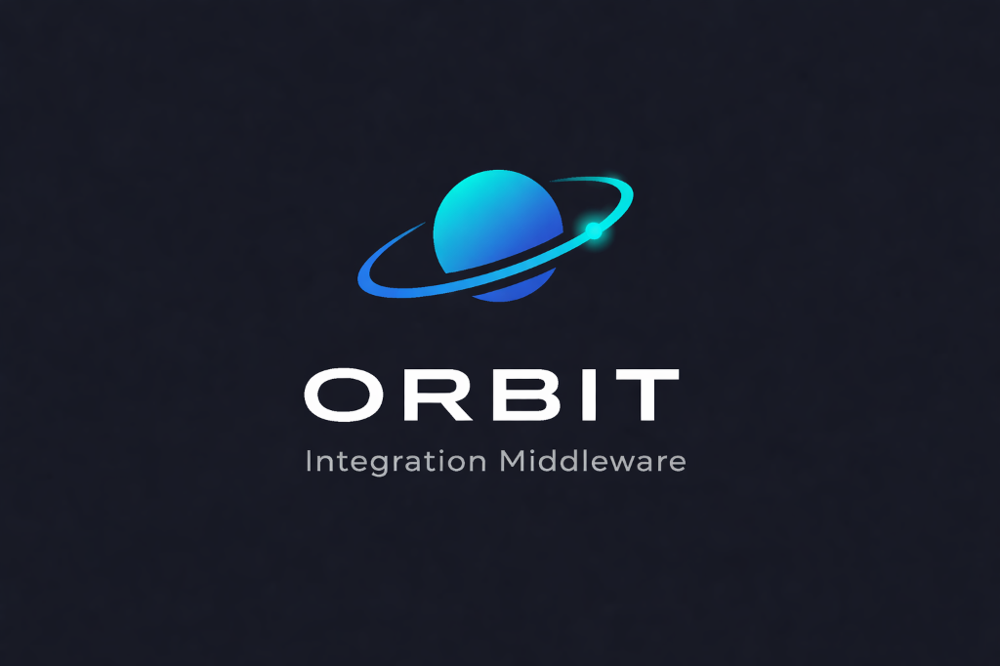

<div align="center">



# ORBIT - Integration Middleware

**Production-ready middleware** connecting Respond.io (or any webhook-enabled platform) to your internal MCP server, with comprehensive monitoring dashboard.

</div>

[](https://www.python.org/)
[](https://fastapi.tiangolo.com/)
[](https://streamlit.io/)
[](https://www.docker.com/)

---

## 🎯 What Is This?

A **complete middleware system** that:
- ✅ Exposes a **public webhook endpoint** for Respond.io (or any platform)
- ✅ Routes requests to your **internal MCP server**
- ✅ Handles **errors, retries, and circuit breaking** automatically
- ✅ Provides a **full-featured dashboard** for monitoring and configuration
- ✅ **Ready for production** with Docker deployment

---

## ⚡ Quick Start

### 1. Clone and Setup

```bash
git clone <your-repo>
cd respondio-middleware

# Copy environment file
cp infra/.env.example infra/.env

# Edit .env with your values
nano infra/.env
```

### 2. Start with Docker

```bash
cd infra

# Development (with mock MCP for testing)
docker-compose up -d

# Production (with your real MCP)
docker-compose -f docker-compose.prod.yml up -d
```

### 3. Access Services

- **API**: http://localhost:8000
- **Dashboard**: http://localhost:8501
- **Mock MCP** (dev only): http://localhost:8080

### 4. Configure Respond.io

In Respond.io:
1. Go to **Settings → Webhooks**
2. Add webhook URL: `https://your-domain.com/webhook`
3. Add header: `X-Webhook-Secret: your-secret-from-env`
4. Select events: **Message Received**

**Done!** 🎉

---

## 📦 Features

### 🔌 Middleware API

- **Webhook Endpoint** - `POST /webhook`
- **Retry Logic** - 3 automatic retries on failure
- **Circuit Breaker** - Prevents cascading failures
- **Response Cache** - Configurable caching
- **Telemetry** - All requests logged to Redis
- **Health Checks** - `/health` and `/ready` endpoints

### 📊 Dashboard (6 Pages)

1. **📊 KPIs & Analytics** - Real-time metrics and charts
2. **📜 Request History** - Search and export requests
3. **🔍 Logs Viewer** - Live log streaming
4. **⚙️ Configuration** - Update MCP, cache, security settings
5. **🔧 Maintenance** - Health checks, testing, system info
6. **💬 Chat** - Test MCP in real-time

### 🔀 Multi-MCP Support (Future-Ready)

Architecture prepared for:
- Multiple MCP servers
- Intelligent routing (keyword, channel, tag-based)
- Load balancing
- Fallback strategies

---

## 🏗️ Architecture

```
┌─────────────┐
│ Respond.io  │
└──────┬──────┘
       │ POST /webhook
       ▼
┌──────────────────┐
│  Middleware API  │
│  - Retry logic   │
│  - Circuit break │
│  - Cache         │
│  - Telemetry     │
└──────┬───────────┘
       │ POST /query
       ▼
┌──────────────┐
│  MCP Server  │
└──────────────┘
       │
       ▼
┌──────────────┐
│  Dashboard   │
│  (Streamlit) │
└──────────────┘
```

---

## 📖 Documentation

- **[Docker Deployment Guide](infra/DOCKER_GUIDE.md)** - Complete Docker setup
- **[Testing Guide](tests/TESTING_GUIDE.md)** - How to test the system
- **[Multi-MCP Support](docs/MULTI_MCP_SUPPORT.md)** - Future multi-MCP architecture
- **[API Documentation](http://localhost:8000/docs)** - Interactive API docs (when running)

---

## 🧪 Testing

### Run Tests

```bash
# Install test dependencies
pip install -r tests/requirements-test.txt

# Run all tests
pytest

# Run with coverage
pytest --cov=api --cov-report=html

# Run specific test file
pytest tests/test_models.py
```

### Test with Mock MCP

```bash
# Start mock MCP server
cd tests
python mock_mcp_server.py

# In another terminal, test the webhook
curl -X POST http://localhost:8000/webhook \
  -H "Content-Type: application/json" \
  -H "X-Webhook-Secret: change-me-in-production-use-strong-secret" \
  -d '{
    "conversation_id": "test_123",
    "contact_id": "contact_456",
    "channel": "whatsapp",
    "user_text": "noticias de tecnología"
  }'
```

---

## ⚙️ Configuration

### Environment Variables

Key variables in `.env`:

```env
# Security (CHANGE IN PRODUCTION!)
WEBHOOK_SECRET=your-super-secret-key
DASHBOARD_USERNAME=admin
DASHBOARD_PASSWORD=your-dashboard-password

# MCP Server
MCP_URL=http://your-mcp:8080/query
MCP_TIMEOUT=5
MCP_MAX_RETRIES=3

# Cache
CACHE_ENABLED=true
CACHE_TTL=300

# Circuit Breaker
CIRCUIT_BREAKER_ENABLED=true
CIRCUIT_FAILURE_THRESHOLD=5
```

### Hot Configuration

Update settings **without restarting** via dashboard:
- MCP URL, timeout, retries
- Cache settings
- Security settings

---

## 🚀 Deployment

### Local Development

```bash
# API
cd api
pip install -r requirements.txt
python main.py

# Dashboard
cd dashboard
pip install -r requirements.txt
streamlit run app.py
```

### Docker (Recommended)

```bash
cd infra
docker-compose up -d
```

### Cloud Platforms

#### Google Cloud Run
```bash
gcloud run deploy respondio-api \
  --source . \
  --platform managed \
  --region us-central1
```

#### AWS App Runner
```bash
# Build and push to ECR
docker build -f infra/Dockerfile.api -t respondio-api .
docker push <ecr-url>/respondio-api:latest
```

#### Azure Container Apps
```bash
az containerapp create \
  --name respondio-api \
  --resource-group <rg> \
  --image <acr>.azurecr.io/respondio-api:latest
```

---

## 📊 Monitoring

### Dashboard Metrics

- **Request Volume** - Requests per hour/day
- **Success Rate** - % of successful requests
- **Latency** - P50, P95, P99 percentiles
- **MCP Performance** - MCP-specific metrics
- **Channel Distribution** - Requests by channel

### Health Checks

```bash
# API health
curl http://localhost:8000/health

# Detailed health (admin)
curl "http://localhost:8000/admin/maintenance/health?username=admin&password=..."
```

---

## 🔐 Security

### Best Practices

1. **Change Default Secrets**
   ```env
   WEBHOOK_SECRET=<generate-strong-secret>
   DASHBOARD_PASSWORD=<strong-password>
   ```

2. **Use HTTPS in Production**
   - Add nginx/traefik with SSL
   - Use Let's Encrypt certificates

3. **Limit Access**
   - Firewall rules
   - IP whitelisting (optional)
   - VPN for dashboard access

4. **Regular Updates**
   ```bash
   docker-compose pull
   docker-compose up -d
   ```

---

## 🛠️ Troubleshooting

### Common Issues

**API won't start**
```bash
# Check logs
docker-compose logs api

# Verify port 8000 is free
netstat -ano | findstr :8000
```

**MCP connection failed**
```bash
# Test MCP from API container
docker-compose exec api curl http://mock_mcp:8080/health

# Check MCP URL in .env
```

**Dashboard can't connect**
```bash
# Verify API is running
curl http://localhost:8000/health

# Check API_URL in dashboard environment
```

---

## 📝 Project Structure

```
respondio-middleware/
├── api/                    # FastAPI application
│   ├── main.py            # Main API
│   ├── models.py          # Pydantic models
│   ├── mcp_client.py      # MCP client
│   ├── admin_api.py       # Admin endpoints
│   └── ...
├── dashboard/             # Streamlit dashboard
│   ├── app.py            # Main app
│   ├── components/       # Reusable components
│   └── pages/            # Dashboard pages
├── shared/               # Shared utilities
│   └── redis_client.py   # Redis client
├── tests/                # Tests
│   ├── test_models.py    # Model tests
│   ├── test_api.py       # API tests
│   └── mock_mcp_server.py # Mock MCP
├── infra/                # Infrastructure
│   ├── Dockerfile.api    # API Dockerfile
│   ├── Dockerfile.dashboard # Dashboard Dockerfile
│   ├── docker-compose.yml # Dev compose
│   └── docker-compose.prod.yml # Prod compose
└── docs/                 # Documentation
```

---

## 🤝 Contributing

Contributions welcome! Please:
1. Fork the repository
2. Create a feature branch
3. Make your changes
4. Add tests
5. Submit a pull request

---

## 📄 License

MIT License - see LICENSE file for details

---

## 🆘 Support

- **Issues**: [GitHub Issues](https://github.com/your-repo/issues)
- **Documentation**: [Full Docs](docs/)
- **Email**: your-email@example.com

---

## 🎉 Acknowledgments

Built with:
- [FastAPI](https://fastapi.tiangolo.com/) - Modern Python web framework
- [Streamlit](https://streamlit.io/) - Dashboard framework
- [Redis](https://redis.io/) - Data storage
- [Docker](https://www.docker.com/) - Containerization

---

---

<div align="center">

**ORBIT - Integration Middleware**

Made with ❤️ for seamless platform integrations

</div>
