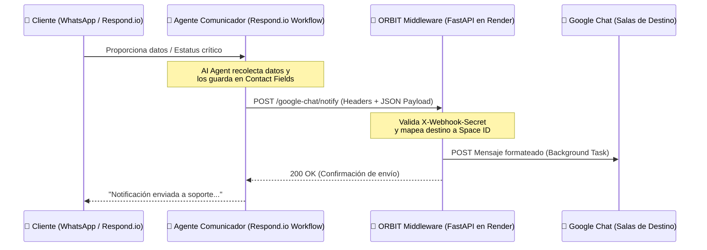

# Plan de Diseño: Agente Comunicador (Respond.io ↔ ORBIT ↔ Google Chat)

Este documento detalla la arquitectura de integración y planeación técnica para implementar el **Agente Comunicador** dentro del ecosistema de ORBIT Middleware y Respond.io.

> [!NOTE]
> Este plan ha sido revisado y guardado para su posterior implementación a solicitud del equipo.

---

## 🗺️ 1. Arquitectura de Flujo de Datos

El **Agente Comunicador** es un flujo de trabajo que actúa como puente conversacional. Su propósito es interactuar con los clientes para recopilar información clave y notificarla en tiempo real en los diferentes grupos de Google Chat según el canal o destino correspondiente.



---

## 🛠️ 2. Especificación Técnica de la API en ORBIT

Para habilitar esta comunicación, se agregará un endpoint público en el archivo [api/admin_api.py](file:///c:/Users/User/Ecosistema-Maxi/Middleware/respondio-middleware/api/admin_api.py) bajo el `public_router`.

### Endpoint: `/google-chat/notify` (POST)

#### Cabeceras (Headers):
```http
Content-Type: application/json
X-Webhook-Secret: [Valor de settings.WEBHOOK_SECRET]
```

#### Cuerpo de la Petición (Payload JSON):
```json
{
  "message": "Mensaje redactado por el agente o el flujo en Respond.io.",
  "level": "INFO",       // Opciones: INFO, SUCCESS, WARNING, ERROR
  "destino": "soporte"  // Opciones: alertas, soporte, ventas (mapeados internamente)
}
```

---

## 🔀 3. Ruteo Multicanal Inteligente (Mapeo Semántico)

Para que el equipo de Respond.io no tenga que manejar los complejos y largos hashes de las salas de Google (`space_id`), el endpoint en ORBIT realizará un **mapeo semántico** de destinos legibles a sus correspondientes IDs de espacio.

El mapeo de canales se almacenará en la configuración de ORBIT de la siguiente manera:

| Destino (`destino`) | Nombre del Grupo de Destino | Google Chat `space_id` de Ejemplo |
| :--- | :--- | :--- |
| **`alertas`** | Orbit Alertas (General) | `spaces/AAQADr-f_9c` (Default) |
| **`soporte`** | Soporte Técnico Maxi | `spaces/AAQADr-soporte_id` |
| **`ventas`** | Ventas y Prospectos | `spaces/AAQADr-ventas_id` |

---

## 📋 4. Configuración en Respond.io

Para implementar este flujo en Respond.io de forma ultra-estable (minimizando alucinaciones del modelo LLM), se recomienda utilizar un flujo **híbrido** de conversación y workflow:

### Paso A: Recopilación conversacional (AI Agent)
1. El **AI Agent** (Agente de IA) en Respond.io chatea con el cliente para recolectar los campos indispensables.
2. La IA mapea y escribe las respuestas del cliente en **Contact Fields** (Campos de Contacto) de Respond.io, como:
   * `$contact.numero_guia`
   * `$contact.nombre_completo`
   * `$contact.resumen_problema`

### Paso B: Disparo asíncrono (Workflow HTTP Request)
1. Al completarse la recopilación de datos, el Workflow de Respond.io toma el control.
2. Ejecuta un nodo de tipo **HTTP Request** configurado de la siguiente manera:
   * **Method:** `POST`
   * **URL:** `https://orbit-api-ewov.onrender.com/google-chat/notify`
   * **Headers:**
     * `X-Webhook-Secret`: `$env.WEBHOOK_SECRET`
   * **Body (JSON):**
     ```json
     {
       "message": "🚨 *Nueva Alerta de Soporte*\n\n👤 *Cliente:* $contact.nombre_completo\n📦 *Guía:* $contact.numero_guia\n📝 *Problema:* $contact.resumen_problema",
       "level": "WARNING",
       "destino": "soporte"
     }
     ```

---

## 🎯 5. Beneficios de esta Implementación

1. **Robustez Absoluta:** Al usar el motor de workflows de Respond.io, el envío a ORBIT es 100% confiable y determinista.
2. **Seguridad Integrada:** Todas las peticiones van firmadas por el `WEBHOOK_SECRET`, impidiendo accesos no autorizados.
3. **Escalabilidad Multicanal:** Se pueden añadir nuevos grupos de Google Chat en el futuro simplemente actualizando el mapeo de destinos en ORBIT, sin alterar los flujos de Respond.io.
4. **Respuestas Inmediatas:** Aprovecha el motor asíncrono de ORBIT (`asyncio.create_task`) para responder al webhook en milisegundos y procesar el envío a Google Chat en segundo plano.
