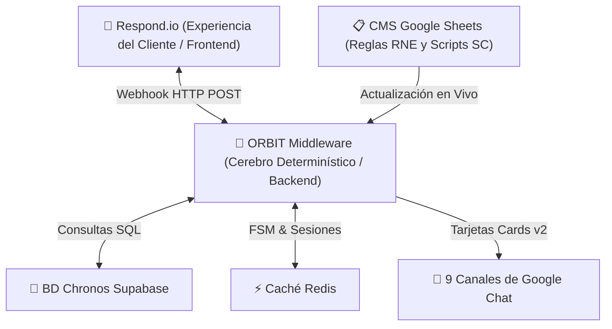

# 🪐 DOCUMENTO MAESTRO INTEGRADO: EVOLUCIÓN, ARQUITECTURA Y MÁQUINA DE ESTADOS (FSM) DE ORBIT v4.7
**Expediente Exhaustivo de Presentación con el Motor de Estados, Integraciones a Google Chat y Avances al 14 de Agosto de 2026**

---

> 💡 **EXPEDIENTE INTEGRADO DE MÁXIMA COBERTURA (AGOSTO 2026):**  
> Este expediente consolida toda la especificación técnica y de negocio de ORBIT v4.7, incluyendo la arquitectura de la Máquina de Estados Finitos (FSM), la matriz de los 15 agentes virtuales, las 9 integraciones a Google Chat, el enforcer de bienvenida (`CU.A1`), la solución de scripts homologados (`SC.011`) y los resultados de pruebas E2E.

---

## 📌 1. Definición y Propósito Estratégico de ORBIT

ORBIT es la plataforma central de orquestación, gobernanza y lógica de negocio backend para el ecosistema de inteligencia conversacional de Maxitransfers. Actúa como el cerebro informático determinístico que evalúa el perfil del usuario, la intención del mensaje, la base de datos de envíos (Chronos), el horario de atención y las 59 Reglas de Negocio (RNE 01-59) antes de autorizar cualquier respuesta visible en WhatsApp.

---

## 🤝 2. La Relación Simbiótica entre ORBIT y Respond.io

Respond.io y ORBIT trabajan en equipo mediante una división clara de funciones entre la interfaz visible (Frontend) y el motor de decisiones (Backend):

* **Respond.io (Experiencia del Cliente / Frontend):**  
  Se encarga de mostrar la pantalla del chat en WhatsApp, presentar los menús interactivos al cliente, recibir las fotos o comprobantes, administrar las colas de espera y permitir que los ejecutivos de Servicio al Cliente tomen el control de la conversación.
* **ORBIT (Cerebro Determinístico / Backend):**  
  Es el cerebro determinístico que evalúa la intención del mensaje, consulta las bases de datos de remesas, valida la identidad del cliente, selecciona el script homologado exacto (ej. `SC.011`) y envía alertas digitales instantáneas a las salas corporativas de Google Chat.

---

## ⚙️ 3. La Máquina de Estados Finitos (FSM): El Control del Ciclo de Vida de la Conversación

Para evitar que las conversaciones caigan en bucles infinitos, pierdan el contexto o respondan fuera de orden, ORBIT opera mediante una **Máquina de Estados Finitos (FSM)** alojada en la memoria ultrarrápida de Redis. La FSM administra rigurosamente cada estado por el que pasa el usuario:

| Estado FSM en Redis | Descripción y Evento Detonador | Garantía de Negocio Ejecutada por ORBIT |
| :--- | :--- | :--- |
| **UNINITIALIZED / IDLE** | Contacto nuevo o sesión cerrada previa. | Prepara el entorno Redis para registrar el `contact_id`. |
| **WELCOME_SENT (Turno 1)** | El cliente envía su primer mensaje. | Ejecuta el Welcome Script Enforcer (`CU.A1` + Aviso de Privacidad). Marca `session:welcome_sent` en Redis. |
| **PROFILING_REQUIRED** | ORBIT requiere validar si es Remitente o Beneficiario. | Envía el script `SC.003` o `SC.008` para solicitar perfilamiento. |
| **PROFILING_COMPLETED** | El usuario confirma su perfil de cliente. | Guarda el perfil verificado en Redis para aplicar reglas como `SC.019` (Privacidad beneficiario). |
| **INTENT_DETECTION** | El usuario expresa su necesidad en lenguaje natural. | El clasificador de ORBIT identifica la intención (Estatus, Fraude, Hardware, etc.). |
| **COLLECTING_TRANSACTION** | Se requiere clave de envío o ticket de remesa. | Envía `SC.008` solicitando la clave de transacción (ej. `CE123456789US`). |
| **QUERYING_CHRONOS** | ORBIT consulta la BD Supabase PostgreSQL. | Realiza la consulta en tiempo real en la base de datos de Chronos de Maxitransfers. |
| **HANDOFF_PENDING** | La intención requiere atención humana o especializada. | Notifica a Google Chat + envía script `SC.011` + asigna la variable `derivacion` para Respond.io. |
| **CSAT_ELIGIBLE** | La consulta automatizada concluyó con éxito. | Bloquea el cierre directo y presenta la encuesta de satisfacción `SC.034`. |
| **CSAT_COMPLETED** | El cliente envía su calificación (1 a 5). | Registra la nota en Google Sheets y despide con script `SC.036`. |
| **CLOSED** | Sesión finalizada formalmente o por timeout (10 min). | Elimina las llaves temporales en Redis para permitir un nuevo inicio limpio. |

---

## 📢 4. Notificaciones en Tiempo Real a las 9 Áreas Corporativas en Google Chat

ORBIT incorpora notificaciones automáticas en tiempo real utilizando la API oficial de Google Chat con Cuentas de Servicio dedicadas para alertar a los 9 departamentos de la empresa:

| Departamento / Área | Canal Dedicado en Google Chat | Función de la Alerta en Tiempo Real |
| :--- | :--- | :--- |
| **Prevención de Fraudes** | `spaces/AAQAQM9pDpg` | Alerta roja inmediata en Turno 1 con nombre, clave y detalle del reporte ante intentos de estafa o phishing. |
| **Monitoreo BSA / AML** | `spaces/AAQA3WL2JIk` | Detección y notificación de patrones de estructuración o fraccionamiento de envíos. |
| **Agent Oversight** | `spaces/AAQAJiVCDAU` | Canalización inmediata de notificaciones del IRS, auditorías o requerimientos legales a agencias. |
| **Soporte Técnico Agencias** | `spaces/AAQAQhx5RTM` | Atención prioritaria de fallas de hardware (escáneres rotos, impresoras, terminales POS en agencias). |
| **Cheques y Nómina** | `spaces/AAQAGZ_m434` | Reportes de verificación de depósitos, cambio de cheques y comprobantes de nómina. |
| **Cobranza y Comisiones** | `spaces/AAQAcEu8NTc` | Consultas sobre aclaraciones de saldos pendientes y comisiones de agencias. |
| **Capacitación POS** | `spaces/AAQAMKgsazw` | Solicitudes de manuales de uso y soporte en el entrenamiento de terminales POS. |
| **Cumplimiento AML/KYC** | `spaces/AAQAbvCUAko` | Recepción y seguimiento de la Forma P-4 y expedientes normativos. |
| **Ventas Internas** | `spaces/AAQAUghCztE` | Lead generation automático para solicitudes de apertura y registro de nuevas agencias. |

---

## 🪐 5. El Mapa Actualizado de los 15 Agentes Virtuales Especializados

ORBIT coordina la arquitectura de 15 agentes especializados que atienden las consultas de los clientes en WhatsApp:

| Agente Virtual | Rol y Especialidad Operativa | Acción Ejecutada por ORBIT |
| :--- | :--- | :--- |
| **1. @Max** | Orquestador Maestro y Ruteador Inicial | Agente principal de entrada en Respond.io. Recibe al usuario e inicia el ruteo hacia los agentes especializados. |
| **2. @VerificadorEstatus** | Validador de remesas generales | Consulta Chronos, aplica Fuzzy Matching y mapea Unclaimed Property. |
| **3. @CancelacionMoneyOrder** | Cancelación de cheques físicos | Consulta saldos y bloquea cheques de forma preventiva. |
| **4. @HistorialEnvios** | Historial de transacciones | Recupera y da formato a los últimos envíos del cliente. |
| **5. @CancelacionEnvio** | Detención de remesas electrónicas | Llama a APIs de corresponsales para frenar cobros activos. |
| **6. @ModificacionDatos** | Cambios ortográficos | Valida discrepancias menores (máximo 3 letras de diferencia). |
| **7. @CoordinacionPago** | Soporte de transacciones | Gestiona problemas y validaciones de pago pendientes. |
| **8. @VerificadorPagoBill** | Pago de servicios básicos | Consulta estados de cobros de servicios y aplica cortesía SC.033. |
| **9. @DerivacionFraudes** | Prevención de estafas | Envía alertas críticas a Google Chat y coordina handoffs. |
| **10. @DerivacionBSA** | Auditoría y Monitoreo BSA | Genera reportes CTR de lavado de dinero estructurados. |
| **11. @AgenteComunicador** | Reportes internos a Google Chat | Publica resúmenes en las 9 salas corporativas de Google Chat. |
| **12. @OrquestadorDocumentos** | Validador KYC Multimodal | Clasifica y extrae información con Gemini Vision de imágenes (INE, recibos). |
| **13. @VerificadorEstatusRecargas** | Estatus de recargas telefónicas | Valida folios de recargas y números celulares en tiempo real. |
| **14. @AgenteCSAT** | Calidad y satisfacción | Captura feedback y escribe reportes de calidad para Procesos. |
| **15. @CancelacionBillRecargas** | Cancelaciones recargas/servicios | Procesa devoluciones de saldos de servicios y celulares. |

---

## 📊 6. Estado Actual de Madurez Funcional y Certificación de Pruebas

Tras las optimizaciones recientes aplicadas esta semana (14 de agosto de 2026), el sistema alcanza los siguientes niveles de estabilidad probada:

* **Saludo CU.A1 e Inicio de Sesión (90-95% Estabilidad):** 100% de éxito garantizado mediante Welcome Script Enforcer en Redis.
* **Estatus de Envíos y Chronos (85-90% Estabilidad):** Consulta exacta de claves CE..., estatus en Chronos y lectura OCR de comprobantes.
* **Privacidad del Beneficiario (90% Estabilidad):** Protección estricta de datos del remitente frente a terceros (`SC.019` / `RNE.18`).
* **Handoff Departamental SC.011 (70-75% -> 85-90% Proyectado):** Notificación inmediata a Google Chat y derivación limpia a Servicio al Cliente.
* **Suite de Pruebas Unitarias Integradas:** 61 de 61 pruebas ejecutadas limpiamente en Pytest sin errores de compilación ni regresiones.
